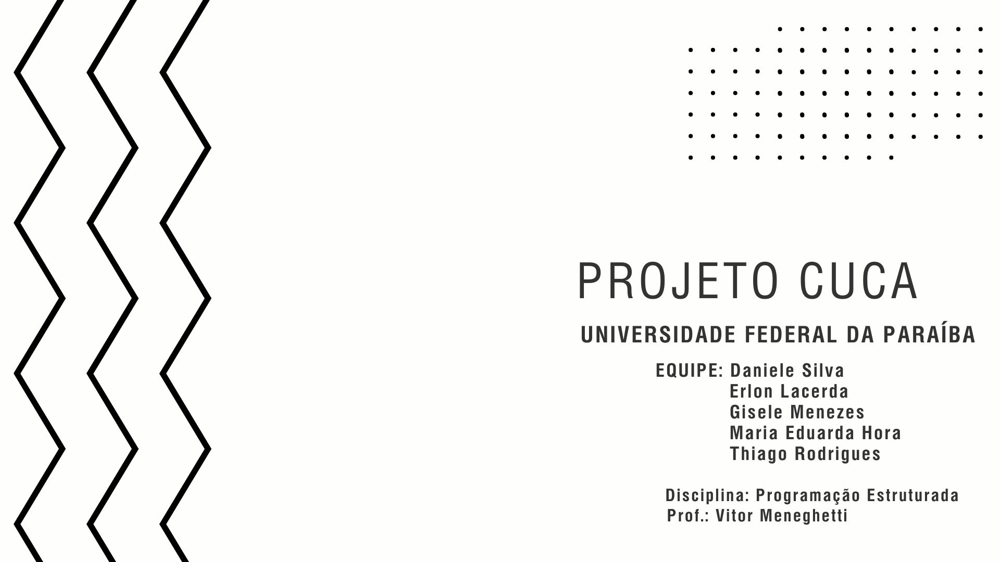

# ProjetoCUCA

## Integrantes

- Erlon Lacerda
- Maria Eduarda
- Thiago Rodrigues
- Gisele Menezes
- Daniele Morais

## O que é o Projeto CUCA?
Classroom Utilization and Capacity Allocation tem como base o sistema SACI da UFPB, é baseado em um **algoritmo de otimização** feito para **alocação de salas** e aulas para turmas, a fim de diminuir intercorrências e comportar a demanda do Centro.

## Programa Principal
### Pré-alocação

### Ver informações

### Modificar alocação

### Qual a vantagem da alocação automática de salas?

Seus resultados são feitos por algoritmo, ou seja, terão maior qualidade, maior constância e não serão baseados na experiência do decisor. 

## Consulta
### Ver salas

### Informações por ID - sala

### Informações por ID - turmas

### Como funciona o Sistema CUCA?

- Recebe as informações de cada turma, como o número de alunos, o horário da aula e o tipo de sala necessária (sala comum ou laboratório).
- Lê as informações das salas disponíveis, como o bloco, número da sala, capacidade e tipo.
- Filtra as salas que atendem aos requisitos da turma em relação ao tipo de sala, horário e capacidade necessária.
- Ordena as salas disponíveis de acordo com a capacidade da sala.
- Atribui a sala mais adequada para a turma.
- Atualiza a disponibilidade da sala.
